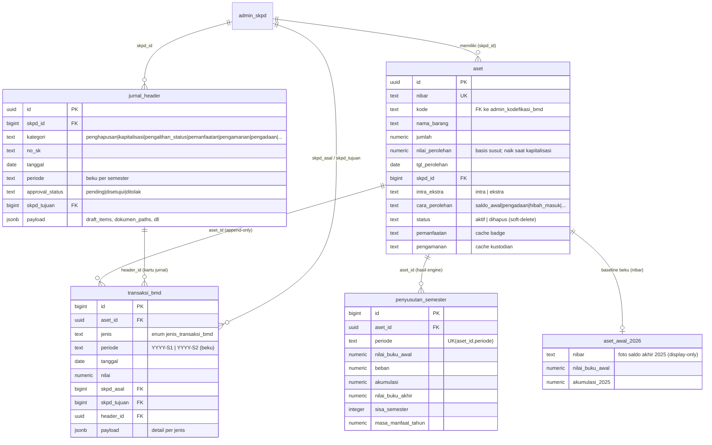
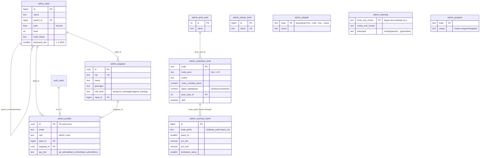
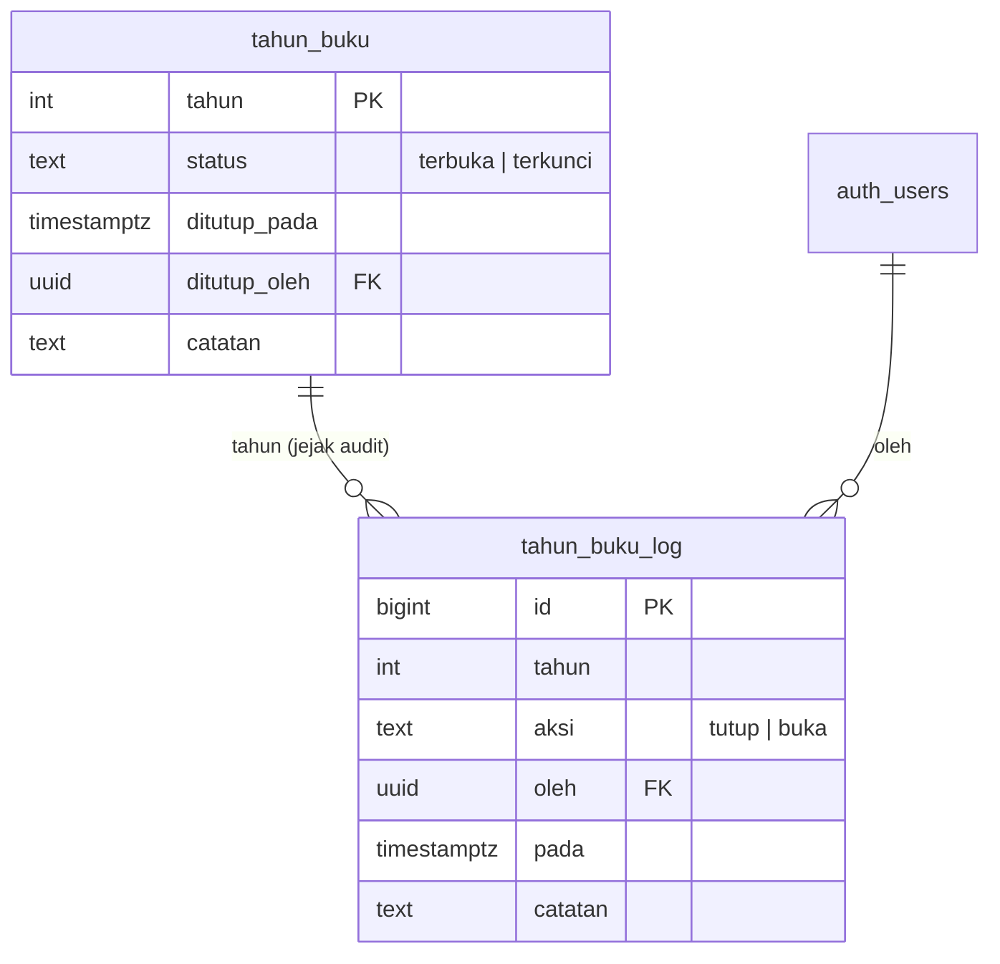
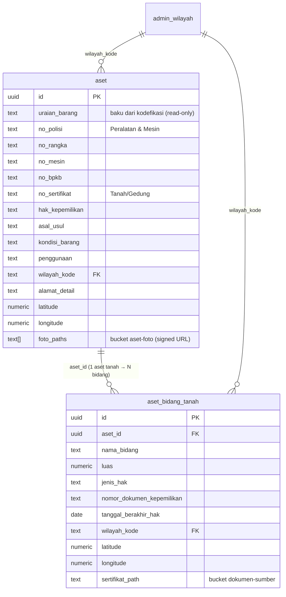
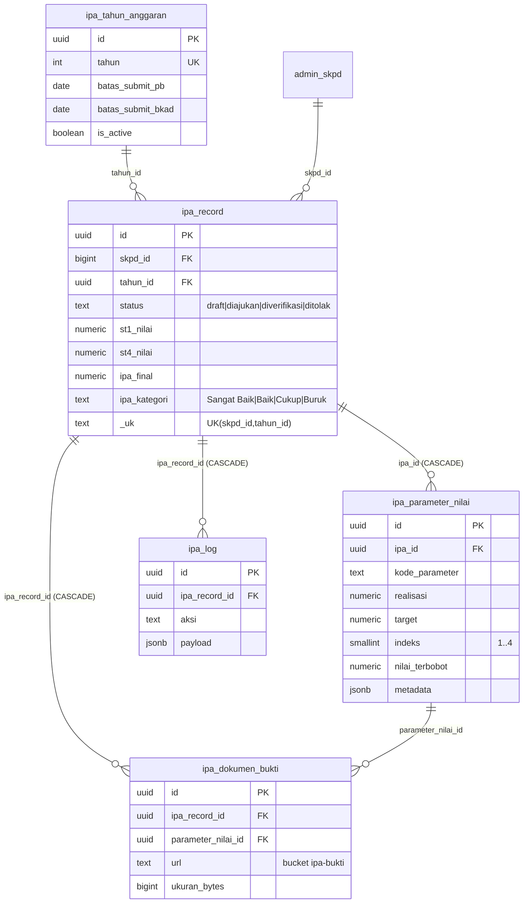
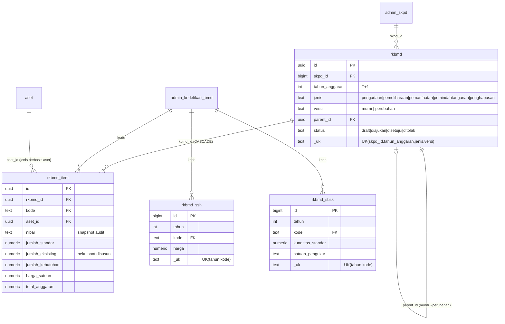
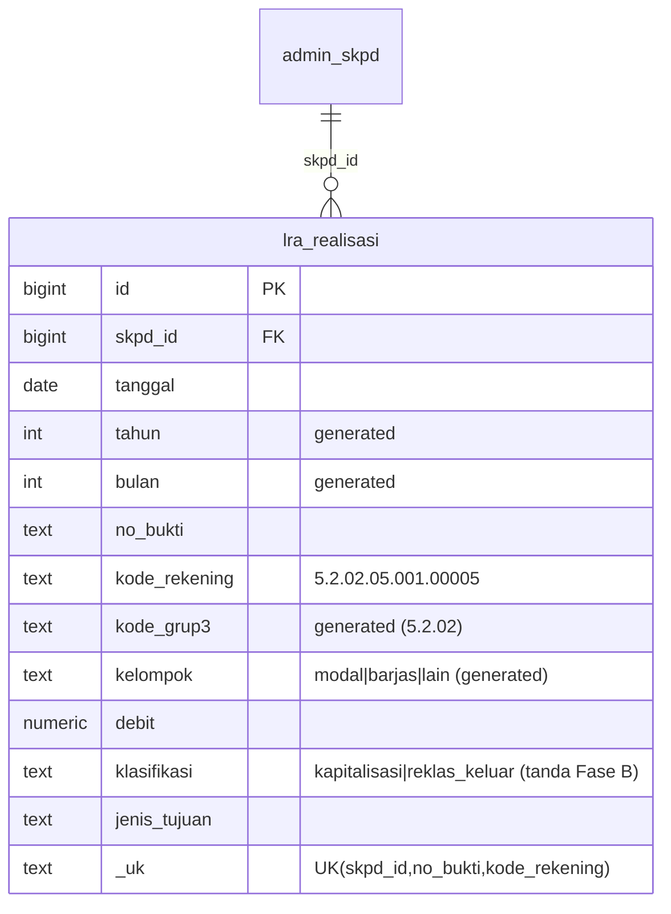
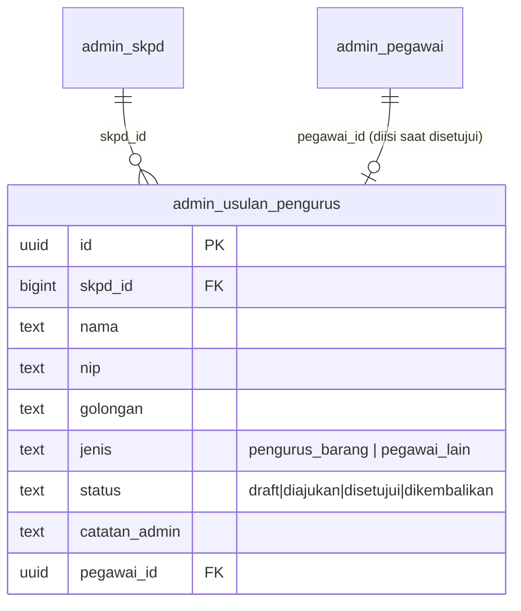
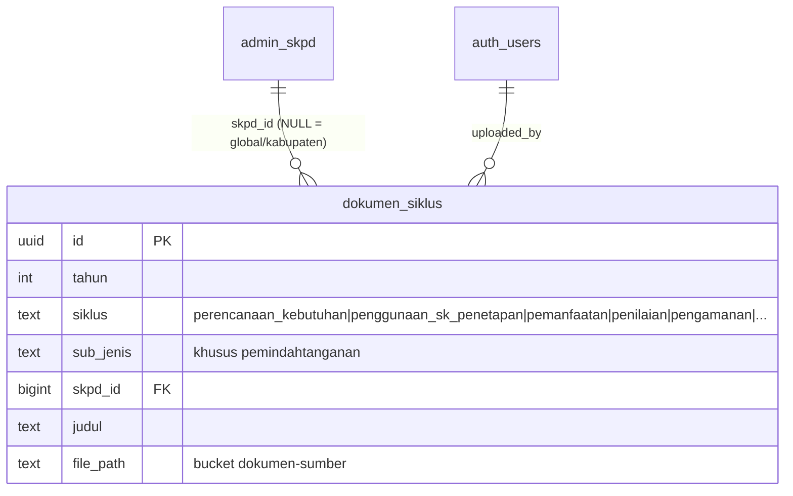
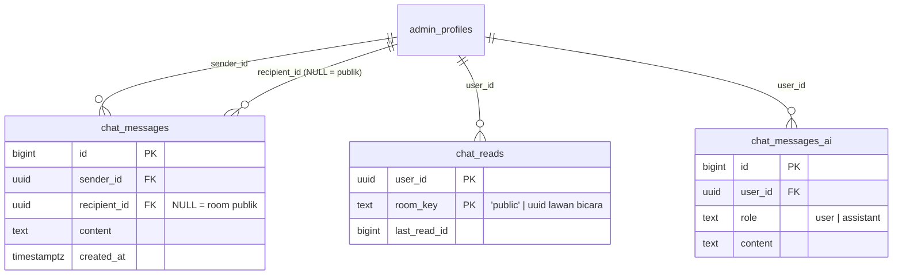

# Skema Database Penyusutan BMD — per Modul

Dokumen ini memetakan skema database (Supabase/PostgreSQL) aplikasi Penyusutan
Barang Milik Daerah (BMD) Kabupaten/Kota Kediri, dikelompokkan **per modul**.
Setiap modul disertai diagram ER (Mermaid) dan dokumentasi ringkas: tujuan tabel,
kunci relasi, dan aturan integritas penting.

> **Konvensi penamaan**
> - Tabel referensi/master di-prefix `admin_` (mis. `admin_skpd`, `admin_kodefikasi_bmd`).
> - Tabel staging import di-prefix `stg_import_*` (transient, tidak digambar detail).
> - `auth.users` = tabel bawaan Supabase Auth (di luar kendali aplikasi).
> - Diagram hanya menampilkan **kolom kunci** (PK/FK/atribut penting) agar terbaca;
>   bukan seluruh kolom.

> **Prinsip lintas-modul yang tercermin di skema**
> - `transaksi_bmd` = **ledger append-only** (UPDATE/DELETE diblokir trigger
>   `fn_transaksi_bmd_immutable`). Koreksi = transaksi baru yang membalik.
> - Penghapusan aset = **soft-delete** (`aset.status='dihapus'`), tak ada policy DELETE.
> - `penyusutan_semester` = **hasil engine** (turunan replay ledger), bukan mirror `aset`.
> - Masa manfaat disimpan dalam **TAHUN** di DB; konversi ×2 ke semester hanya di engine.
> - RLS per-SKPD berbasis `ltree` (`admin_skpd.path`) + fungsi `fn_skpd_visible()`,
>   `fn_is_admin()`, `fn_is_viewer()` (dibungkus InitPlan `(SELECT ...)` di path panas).

---

## Peta Modul

| # | Modul | Tabel Inti |
|---|-------|-----------|
| 1 | Inti / Ledger BMD | `aset`, `transaksi_bmd`, `penyusutan_semester`, `jurnal_header`, `aset_awal_2026` |
| 2 | Referensi & Master (`admin_`) | `admin_skpd`, `admin_profiles`, `admin_kodefikasi_bmd`, `admin_jenis_aset`, `admin_overhaul_band`, `admin_pegawai`, `admin_satuan_bmd`, `admin_wilayah`, `admin_rekening`, `admin_program` |
| 3 | Tahun Buku (kunci akuntansi) | `tahun_buku`, `tahun_buku_log` |
| 4 | Spesifikasi & Detail Aset | kolom lebar `aset`, `aset_bidang_tanah` |
| 5 | IPA (Indeks Pengelolaan Aset) | `ipa_tahun_anggaran`, `ipa_record`, `ipa_parameter_nilai`, `ipa_dokumen_bukti`, `ipa_log` |
| 6 | RKBMD (Perencanaan Kebutuhan) | `rkbmd_ssh`, `rkbmd_sbsk`, `rkbmd`, `rkbmd_item` |
| 7 | LRA / Rekonsiliasi Belanja | `lra_realisasi` |
| 8 | Usulan Pengurus Barang | `admin_usulan_pengurus` |
| 9 | Dokumen Siklus | `dokumen_siklus` |
| 10 | Chat / Kolaborasi | `chat_messages`, `chat_reads`, `chat_messages_ai` |
| 11 | Import / Staging | `stg_import_*` |

---

## 1. Modul Inti / Ledger BMD

Jantung aplikasi: register aset + ledger transaksi append-only + hasil penyusutan.
Menu ber-No SK (Penghapusan, Kapitalisasi, Reklasifikasi, Pengalihan, Pemanfaatan,
Pengamanan, Pengadaan, dll.) memakai `jurnal_header` sebagai "sampul" yang boleh
diedit, sedangkan baris ledger tetap beku.

**Catatan integritas**
- `transaksi_bmd.jenis` adalah enum `jenis_transaksi_bmd` yang tumbuh lewat migrasi
  (`saldo_awal`, `pengadaan`, `kapitalisasi`, `reklas_kode`, `pengalihan_status`,
  `penghapusan_*`, `batal_*`, `pemanfaatan`, `pemanfaatan_selesai`, `pengamanan`,
  `pengembalian_pengamanan`, `akumulasi_kdp`, dll.). **Deploy-ordering**: migrasi
  `ADD VALUE` enum wajib jalan **sebelum** deploy kode pembaca.
- Visibilitas period-aware Daftar Barang & Penyusutan dihitung dengan **replay
  event ledger** (`SEMBUNYI` vs `MUNCUL`), bukan cek `aset.status` langsung.
- `jurnal_header` boleh diedit (No SK/tanggal) tetapi dijaga trigger
  `fn_jurnal_header_guard`: tak boleh ganti `skpd_id`/`kategori`, dan tanggal baru
  wajib tetap di **semester** yang sama (periode beku).
- `aset_awal_2026` (rename dari `saldo_awal_2026`) = baseline beku, tak pernah
  disentuh transaksi.

---

## 2. Modul Referensi & Master (`admin_`)

Data referensi satu-kopi dibagi lintas tahun. Ditulis hanya oleh admin
(`fn_is_admin()`), dibaca semua user login. `admin_skpd` memakai `ltree` untuk
hierarki organisasi (induk → sub-OPD → lokasi) yang menjadi dasar seluruh RLS.

**Catatan integritas**
- `admin_skpd.path`/`level` di-set otomatis oleh trigger `fn_skpd_set_path` dari
  `parent_id`; memindah induk akan meng-cascade reparent seluruh descendant.
- `fn_my_skpd_path()`, `fn_skpd_visible()`, `fn_is_admin()` semua membaca
  `admin_profiles`/`admin_skpd` — inti mesin RLS.
- `admin_kodefikasi_bmd.batas_kapitalisasi` dipakai `klasifikasiKomptabel()` untuk
  menentukan intra vs ekstra saat approve perolehan.
- `admin_overhaul_band` menentukan tambahan masa manfaat saat kapitalisasi/overhaul
  (band per persentase rehab).

---

## 3. Modul Tahun Buku (kunci tahun akuntansi)

Tabel kontrol murni — **tidak** mempartisi data. Dibaca oleh trigger
`fn_cek_tahun_buku` (dipasang di `transaksi_bmd` dan `jurnal_header`) untuk menolak
entry di tahun terkunci / bertanggal masa depan.

**Catatan integritas**
- Tahun yang **belum terdaftar = default TERKUNCI** (fail-closed). Tahun baru wajib
  di-seed (status `terbuka`) sebelum tanggal masuk ke tahun itu.
- `tahun_buku_log` append-only (trigger `fn_tahun_buku_log_immutable`).
- Whitelist retroaktif (`batal_pengadaan`, `batal_penghapusan`, `batal_kapitalisasi`)
  boleh menembus tahun terkunci; forward-date **tidak pernah** boleh.
- RPC terkait: `fn_tutup_tahun(p_tahun, p_catatan)` (checkpoint massal ke
  `penyusutan_semester` + kunci tahun + buka tahun berikutnya) dan
  `fn_preview_tutup_tahun(p_tahun)` (list jurnal pending penghambat tutup).

---

## 4. Modul Spesifikasi & Detail Aset

Field spesifikasi disimpan sebagai **kolom nullable lebar** di `aset` (satu tabel
untuk semua golongan, template per golongan diatur di `lib/asetFields.ts`). Kekecualian:
Tanah dapat punya **banyak bidang** → tabel anak `aset_bidang_tanah` (1:N).

**Catatan integritas**
- `FieldKey` di `lib/asetFields.ts` = nama kolom DB **persis 1:1** — jaga sinkron
  saat rename kolom.
- `aset_bidang_tanah` **bukan ledger** — boleh UPDATE/DELETE langsung (data deskriptif).
- Kolom lama `titik_koordinat`/`lokasi` sudah di-drop; lokasi kini via
  `wilayah_kode` + `alamat_detail` + `latitude`/`longitude`.
- Foto di bucket privat `aset-foto`; dokumen di `dokumen-sumber` (image + PDF).

---

## 5. Modul IPA (Indeks Pengelolaan Aset)

Penilaian skor pengelolaan aset per SKPD per tahun dengan alur
submit → verifikasi. Meng-`extend` `admin_skpd`/`admin_profiles` (kolom tambahan),
tabel skor genuinely baru di-prefix `ipa_`.

**Catatan integritas**
- Satu SKPD hanya punya satu `ipa_record` per tahun (`UNIQUE(skpd_id,tahun_id)`).
- Role IPA terpisah dari role BMD: `admin_profiles.ipa_role` (nullable).
- Bukti di bucket privat `ipa-bukti` (image + PDF, 10 MB).

---

## 6. Modul RKBMD (Rencana Kebutuhan BMD)

Dokumen **perencanaan** tahun anggaran T+1. Sengaja **di luar** ledger — future
year normal, tidak menyentuh `aset`/`transaksi_bmd`. Baris bebas diedit selama
belum disetujui.

**Catatan integritas**
- `rkbmd_ssh` (Standar Satuan Harga) & `rkbmd_sbsk` (Standar Barang & Kebutuhan) =
  referensi per-tahun sekabupaten (bukan per-SKPD).
- Approve hanya membekukan `status`; **tidak** ada materialisasi ke ledger.
- `rkbmd_item` satu tabel lebar untuk 5 jenis (kolom nullable per jenis).

---

## 7. Modul LRA / Rekonsiliasi Belanja

Data referensi hasil import dari akuntansi (Laporan Realisasi Anggaran), bahan
Rekonsiliasi Belanja Modal. **Bukan ledger** — bebas upsert/delete, bukan subjek
Tahun Buku.

**Catatan integritas**
- Natural key `(skpd_id, no_bukti, kode_rekening)` untuk upsert anti-dobel.
- Kolom TANDA (`klasifikasi`/`jenis_tujuan`) diisi di Fase B (Kapitalisasi/Reklas);
  re-import tidak menimpanya (payload upsert tak menyertakan kolom tanda).
- `kode_rekening` merujuk konsep bagan akun di `admin_rekening`.

---

## 8. Modul Usulan Pengurus Barang

Alur usul → ajukan → admin setujui/kembalikan → (disetujui) auto-materialize ke
`admin_pegawai`. Data administratif, bukan ledger.

**Catatan integritas**
- Pola mirip draft-approve Cara Perolehan, tapi tabel sendiri (bukan `jurnal_header`)
  karena bukan barang.
- Saat disetujui, materialize ke `admin_pegawai` (`role_bmd='pengurus_barang'`) dan
  isi `pegawai_id`.

---

## 9. Modul Dokumen Siklus

Penyimpanan generik dokumen siklus BMD yang belum punya modul sendiri (SK RKBMD,
SK Penetapan Status Penggunaan, Perjanjian Pemanfaatan, dll). Siklus yang sudah
punya penyimpanan (Pengadaan, Pengalihan, Penghapusan) dibaca langsung dari
`jurnal_header.payload.dokumen_paths`, tidak diduplikasi ke sini.

**Catatan integritas**
- Role 3 tingkat diturunkan dari struktur SKPD (tanpa kolom role baru):
  super admin BKAD (`fn_is_admin`), admin SKPD induk (`fn_skpd_admin_induk`, hanya
  siklus `pengamanan`), dan non-admin (lihat/unduh saja).
- Pemanfaatan & Pemindahtanganan sengaja global (`skpd_id NULL`).

---

## 10. Modul Chat / Kolaborasi

Fitur komunikasi antar user platform: chat grup publik + DM 1-on-1 + asisten AI.
Bukan ledger — boleh diedit/dihapus pemiliknya.

**Catatan integritas**
- `chat_messages.recipient_id IS NULL` = pesan room publik; diisi = DM privat
  (RLS: hanya pengirim & penerima yang bisa baca).
- `chat_reads` (PK gabungan `user_id`+`room_key`) melacak badge unread lintas sesi.
- `chat_messages_ai` terpisah — percakapan pribadi user dengan AI (via OpenRouter),
  RLS hanya pemilik.

---

## 11. Modul Import / Staging

Tabel `stg_import_*` menampung data mentah Excel sebelum dimaterialisasi ke `aset`
+ `transaksi_bmd` (`saldo_awal`). Bersifat **transient** (beberapa sudah di-drop
setelah selesai). Tidak digambar detail karena bukan bagian model runtime.

Contoh: `stg_import_peralatan_mesin`, `stg_import_gedung`, `stg_import_jalan_irigasi`,
`stg_import_atl`, `stg_import_aset_lain_lain`, `stg_import_aset_lain_lain_diknas`,
`stg_import_atl_diknas`.

**Pola materialisasi**: staging → validasi/mapping golongan → insert `aset`
(intra/ekstra dihitung) + `transaksi_bmd` jenis `saldo_awal` → engine dijalankan
untuk mengisi `penyusutan_semester`.

---

## Lampiran: Storage Buckets

| Bucket | Privat | MIME | Dipakai |
|--------|--------|------|---------|
| `aset-foto` | ya | image/jpeg,png,webp | Foto barang (`aset.foto_paths`) |
| `dokumen-sumber` | ya | image + application/pdf | Dokumen jurnal (BAST, SK, sertifikat, pemanfaatan, pengamanan) |
| `ipa-bukti` | ya | image + application/pdf | Bukti penilaian IPA (`ipa_dokumen_bukti.url`) |

Semua bucket privat ditampilkan lewat **signed URL** (bukan public URL).
